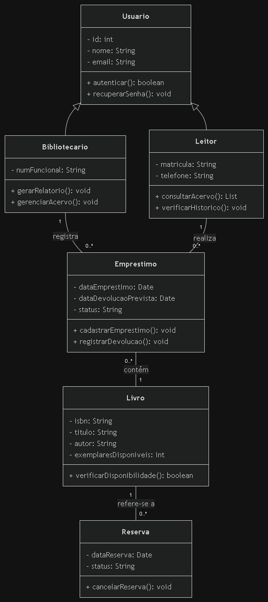

# Atividade 18 — Diagrama de Classes do BiblioTech

**Nome:** Rafael Lopes  
**Turma:** 2º ano 

---

## 🗺️ Diagrama

---

## 🔢 Por que estes números (associação Bibliotecario — Emprestimo)

- **Perto de Emprestimo eu coloquei `0..*` porque:** um bibliotecário pode registrar zero (caso seja recém-contratado ou atue em outra função no dia) ou vários empréstimos ao longo do seu turno de trabalho.
- **Perto de Bibliotecario eu coloquei `1` porque:** cada registro de empréstimo no sistema é efetuado por exatamente um bibliotecário responsável no balcão.

---

## 🔗 Rastreabilidade (Nível B)

- A operação `cadastrarEmprestimo()` da classe `Emprestimo` atende ao caso de uso **UC01 - Realizar Empréstimo** do diagrama de casos de uso da Atividade 17.

---

## 🧹 Refinamento do Modelo (Nível A - Enxugando o Diagrama)

- **Remoção realizada:** Removi o atributo `nomeLeitor` que estava incorretamente posicionado dentro da classe `Livro`.
- **Justificativa:** O nome do leitor pertence exclusivamente à classe `Leitor` (herdado de `Usuario`). Manter dados do leitor na classe `Livro` violaria o princípio de coesão e geraria duplicidade desnecessária de dados.

---

## 🗣️ Defesa Técnica (Nível A)

> **Objeção do colega:** "Bibliotecario nem precisava ser classe — bastava um atributo `bibliotecario: String` dentro de `Emprestimo`. Ele está certo?"

**Resposta e Defesa:**  
**Não, o colega não está certo.** Tratar o bibliotecário apenas como uma `String` dentro da classe `Emprestimo` traz severos problemas de modelagem:
1. **Perda de Rastreabilidade e Autenticação:** `Bibliotecario` é um ator/usuário do sistema, possuindo credenciais (`login`, `senha`), permissões específicas de acesso e métodos próprios (ex: `relatorioVencidos()`).
2. **Redundância e Erros de Digitação:** Armazenar uma `String` repetidamente em cada empréstimo abre margem para inconsistências de dados (ex: "Ana Silva", "A. Silva").
3. **Herança e Reuso:** Como `Bibliotecario` herda de `Usuario`, ele reaproveita atributos e comportamentos comuns (como `nome`, `cpf`, `email`), mantendo a arquitetura limpa, coesa e expansível.

---

## 🎯 Autoavaliação

- **Conceito que pretendo:** Nível A (Excelente)
- **Onde isso se prova no diagrama:**
  - **Nível C:** Ligação contínua entre `Bibliotecario` e `Emprestimo` com rótulo em verbo (`registra`) e multiplicidades `1` e `0..*`. Heranças com triângulo vazado apontando para `Usuario`.
  - **Nível B:** Inclusão da nova classe `Reserva` (com 3 compartimentos, associada à classe `Livro` com multiplicidade `0..*`) e adição da linha de rastreabilidade.
  - **Nível A:** Limpeza do modelo (removendo atributos intrusos) e defesa conceitual fundamentada contra a simplificação da classe `Bibliotecario`.